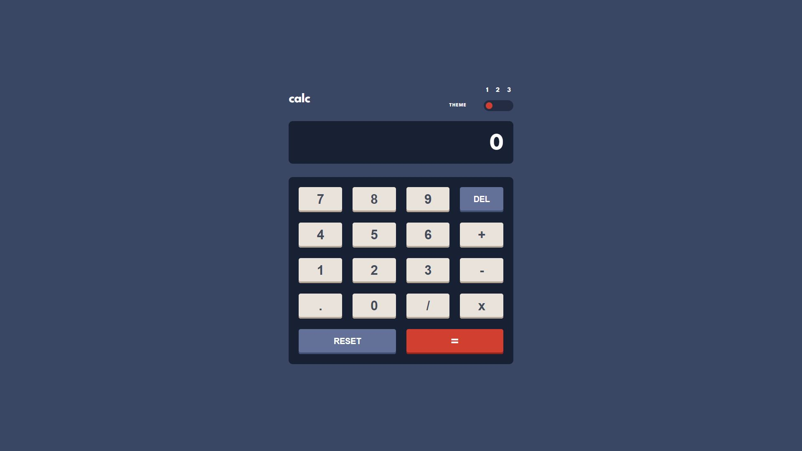
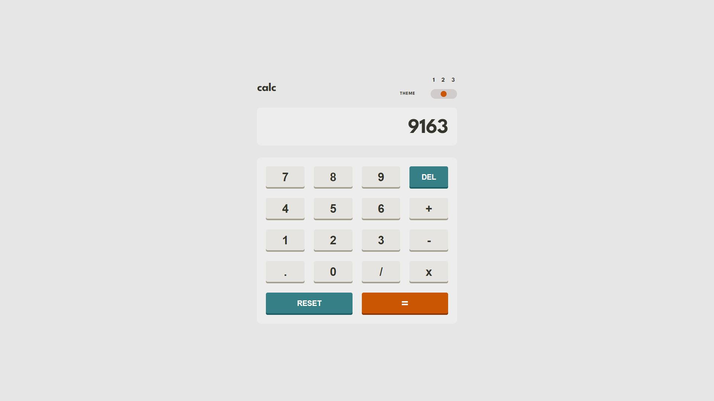
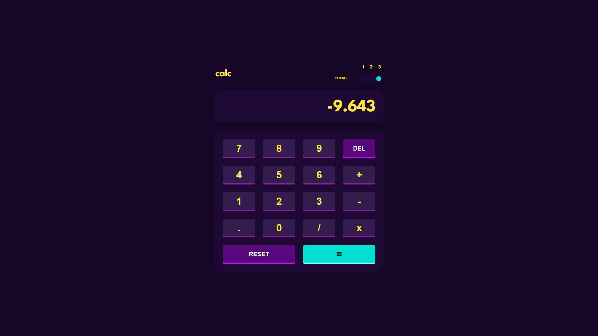

# Frontend Mentor - Calculator app solution

This is my solution to the [Calculator app challenge on Frontend Mentor](https://www.frontendmentor.io/challenges/calculator-app-9lteq5N29).

## Table of contents

- [Overview](#overview)
  - [The challenge](#the-challenge)
  - [Screenshot](#screenshot)
  - [Links](#links)
- [My process](#my-process)
  - [Built with](#built-with)
  - [What I learned](#what-i-learned)
  - [Continued development](#continued-development)
  - [Useful resources](#useful-resources)
- [Author](#author)
- [Acknowledgments](#acknowledgments)


## Overview

### The challenge

Users should be able to:

- See the size of the elements adjust based on their device's screen size
- Perform mathmatical operations like addition, subtraction, multiplication, and division
- Adjust the color theme based on their preference
- Have their theme preference loaded from localStorage

### Screenshot





### Links

- [Solution](#)
- [Live Site](https://helsel-calculator-ts.netlify.app/)

## My process

### Built with

- Semantic HTML5 markup
- Flexbox
- CSS Grid
- Mobile-first workflow
- [SCSS](https://sass-lang.com/)
- [React](https://reactjs.org/)
- [Vite](https://vitejs.dev/)
- [TypeScript](https://www.typescriptlang.org/)

### What I learned

So this is actually the third time I've made this calculator. The first time I made it, I used a very plain HTML, CSS and JavaScript stack. At the time, I wasn't using source control for my projects yet and actually lost the source for the project. While the source was lost, [it's still live on Netlify.](https://calculator-helsel.netlify.app/)

[My second crack at it](https://helsel-react-calculator.netlify.app/) was my very first React project and my second Tailwind project. At that point I actually was using Git and so the [source](https://github.com/JIH7/react-tailwind-calculator) is still available. While it was a great way to learn React, I feel like the final product actually looks worse than my original! Also both versions have some pretty buggy calculator implementations.

A recurring theme in my last several projects has been more organized styles. This time I learned about `@use` in SCSS. This allowed for much more organized style sheets that still all compile to one output CSS file, as well as the ability to import my SCSS variables when needed. I also used variables for my media query breakpoints which helped make things feel even more organized. I did encounter an issue when I switched from my desktop to my laptop, not realizing that my laptop had a zoom level of 1.5 times set in windows which completely broke my layout. I did learn a bit about CSS pixel ratios, but ultimately just added a media query for screen height that shrinks the page vertically a bit.

As for React and TypeScript, I made a calculator class that I wanted to store in a state variable. I ran into issues updating it as using the spread operator to pass it's values so React would actually re-render caused the object to lose it's functions. Ultimately, I made a second class for the variables, and a new Calculator is declared every time something updates with a CalculatorData object passed into the constructor.

```ts
const [calcData, setCalcData] = useState(new CalculatorData())

const updateCalculator = (input: string) => {
    const calculator = new Calculator(calcData);
    calculator.process(input);

    const data = calculator.data;
    setCalcData({...data});
}
```

 I was pretty happy with this solution, although I do wonder whether this was the best way to do this. If anyone has any insight to this I would love to hear from you!

 Another goal I had with this iteration of the project was to support keyboard input. I was surprised to learn I could do this on a React component that doesn't render anything!

 ```ts
import { useEffect } from "react";

interface KeyListenerProps {
  onKeyPress?:Function;
}

function KeyListener({ onKeyPress = () => console.log("No 'onKeyPress' function set.") } : KeyListenerProps) {
  useEffect(() => {
      const handleKeyPress = (e: KeyboardEvent) => {
        onKeyPress(e.key);
      };
  
      window.addEventListener('keydown', handleKeyPress);
  
      return () => {
        window.removeEventListener('keydown', handleKeyPress);
      };
    }, [onKeyPress]);

  return null;
}

export default KeyListener
 ```

I believe (fingers crossed) that this implementation is memory safe. I always try to be wary when using `useEffect()` and I'm still learning the ins and outs.

My actual calculator implementation is modeled largely after the behavior of the Windows 10 calculator since it was an easy reference. My previous versions had some major issues with chaining multiple operations. The first one also wouldn't handle overflow at all and would instead display an error message "OVERFLOW" on screen. I think my solution this time is pretty effective. There are maybe a few more booleans tracking aspects of calculator state than I'd like, but I think I've really trimmed the fat and reused things while also preventing more issues this time around.

### Continued development

### Useful resources

## Author

- Website - [Jeremy Helsel](https://jeremyhelsel.com/)
- Frontend Mentor - [@JIH7](https://www.frontendmentor.io/profile/JIH7)

## Acknowledgments
